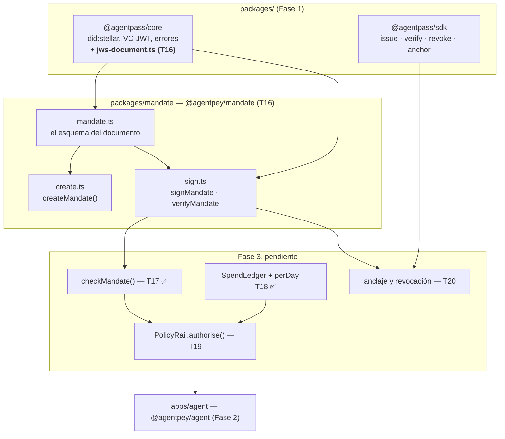

# Arquitectura técnica — PolicyRail + Mandato (Fase 3)

> Mapa técnico denso y autocontenido de la Fase 3: para darle contexto a un chat
> nuevo sin que tenga que leer el código.
>
> Qué prueba la fase: [CONTEXTO.md](CONTEXTO.md) ·
> Estado hito a hito: [BITACORA.md](BITACORA.md) ·
> Decisiones con su motivo: [DECISIONES.md](DECISIONES.md) ·
> Lo que la Fase 2 deja: [../fase-2-agente-compra/ARQUITECTURA.md](../fase-2-agente-compra/ARQUITECTURA.md)

**Estado:** T18 cerrado. Las secciones marcadas *(pendiente)* describen el
diseño acordado, no código que exista.

---

## 1. Vista de conjunto



`@agentpey/mandate` depende de `@agentpass/core` y de nada más del repo. Ni
`core`, ni `sdk`, ni el agente saben que existe.

## 2. Los tres documentos firmados del proyecto

| | credencial | intent | **mandato** |
|---|---|---|---|
| fase | 1 | 2 | **3** |
| firma | el emisor | el agente | **el principal** |
| `typ` | `vc+jwt` | `intent+jwt` | **`mandate+jwt`** |
| ventana | `validFrom`/`validUntil` | `issuedAt`/`expiresAt` | `validFrom`/`validUntil` |
| códigos | `CredentialExpired`… | `IntentExpired`… | `MandateExpired`, `MandateNotYetValid` |
| anclado | sí | no | **sí** (`M-3`) |

Los tres `typ` son distintos y cada verificador rechaza los otros dos: un
documento de un tipo no puede pasar por otro. Hay un test por cada dirección.

## 3. `jws-document.ts` — la maquinaria, una sola vez

`packages/core/src/jws-document.ts` (T16, `M-5`). Firma y verifica **cualquier**
documento estructurado como JWS compacto con una llave `did:stellar`,
parametrizado por un perfil:

```ts
interface JwsDocumentProfile<T> {
  readonly typ: string;                          // "mandate+jwt"
  readonly schema: z.ZodType<T>;                  // el esquema completo
  readonly signerField: string;                    // para espiar antes de la firma
  readonly signerDid: (document: T) => StellarDid;  // el mismo campo, ya tipado
  readonly invalidCode: AgentPassErrorCode;
}
```

Las dos reglas de la Fase 1 quedan dentro y no son opcionales:

1. **`kid` nunca elige la llave de verificación.** Sale siempre de un campo del
   payload; `kid` solo se contrasta.
2. **La firma se verifica antes que cualquier cosa sobre el contenido.** El
   esquema completo corre solo sobre bytes que el firmante firmó.

Y una tercera, propia de la versión genérica: `signerField` y `signerDid` nombran
el mismo campo dos veces —uno para espiar el payload sin validar, el otro para
leerlo ya tipado— así que se **cruzan** después de verificar. Un perfil cuyos dos
campos no coincidan verificaría contra una llave y reportaría otra; hay un test
que lo prueba con un perfil deliberadamente inconsistente.

**No chequea ninguna ventana temporal**, a propósito: cada documento nombra la
suya con campos distintos y la reporta con códigos distintos. El llamador la
chequea sobre lo que esta función devuelve, que ya es el orden correcto.

`vc-jwt.ts` y el firmado de intents **no** se reescribieron para usar esto —
ver `M-5`.

## 4. La forma del Mandato

```ts
interface AgentPayMandate {
  "@context": ["https://www.w3.org/ns/credentials/v2"];
  type: ["VerifiableCredential", "AgentPayMandate"];
  mandateId: string;        // uuid — ver M-6
  issuer: string;            // did:stellar del PRINCIPAL. Firma este documento.
  validFrom: string;          // ISO 8601
  validUntil: string;          // ISO 8601 — obligatorio, ver M-7
  credentialSubject: {
    id: string;                // did:stellar del agente que este mandato habilita
    grant: Scope;               // EL MISMO Scope de la credencial — ver M-4
  };
  credentialStatus: { type: "AgentPassRegistry2026"; registry: string };
}
```

Tres cosas que no son obvias:

**El `issuer` *es* el principal.** No hay un campo `principal` aparte que lo
duplique: dos campos que siempre tienen que coincidir son un bug esperando el
único camino de código que se olvide de cruzarlos.

**`grant` es `scopeSchema` reusado tal cual**, no una copia con la misma forma.
`M-4` depende de eso: la intersección entre lo que el emisor firmó y lo que el
principal consintió solo es significativa —y solo es type-safe— si las dos cosas
son la misma estructura.

**Se conserva el sobre W3C VC 2.0 y el nombre `credentialStatus`**, aunque suene
raro en un mandato. No es imitación: es lo que hace que `anchor(issuer, hash,
subject, expires_at)` mapee sin sobrar nada (`M-3`).

## 5. Firmar y verificar un Mandato

```ts
createMandate(request, { now? }): AgentPayMandate       // arma, no firma
signMandate(mandate, keypair): Promise<SignedMandate>   // el principal firma
verifyMandate(jws, { now? }): Promise<VerifiedMandate>  // offline, siempre
```

`signMandate` falla con **`SignerMismatch`** si la llave no es el `issuer` del
documento. El caso que más importa de esa protección: **un agente no puede
firmar su propio mandato.** Tiene su propio test, nombrado así.

`verifyMandate` chequea, en este orden: header (`alg`, `typ`) → espía el
`issuer` → cruza el `kid` → **firma** → esquema completo → cruce del signer →
**ventana**. La ventana al final, por la misma razón de la Fase 1: un mandato
falsificado *y* vencido tiene que reportar la falsificación, no la expiración.

Bordes **inclusivos** en los dos extremos, igual que `validUntil` en la Fase 1 y
`expires_at` en el contrato — para que los tres nunca discrepen sobre cuál es el
último instante válido.

Lo que `verifyMandate` **no** hace: consultar el registro (necesita red, y en
qué registro confiar es del llamador — misma regla de `RegistryMismatch`), ni
comparar el mandato contra ningún intent (eso es `checkMandate`, T17, y
separarlo es lo que la deja ser una función pura).

## 6. Anclar y revocar un Mandato — T20 ✅

```ts
interface RegistryAccess {           // el puerto — cuatro métodos, no un AgentPass completo
  readonly config: { readonly contractId: string };
  anchor(params): Promise<string>;
  status(hash): Promise<CredStatus>;
  issuerStatus(address): Promise<{ registered: boolean; active: boolean }>;
  revoke(params): Promise<string>;
}

anchorMandate(registry, { mandate, principal }): Promise<AnchoredMandate>
verifyMandateOnChain(registry, jws, { now? }): Promise<FullyVerifiedMandate>
revokeMandate(registry, { mandateHash, principal }): Promise<string>
```

Mismo contrato de la Fase 1 (`agent_registry`), sin tocarlo — el mapeo de `M-3`:

| `anchor(issuer, cred_hash, subject, expires_at)` | el Mandato |
|---|---|
| `issuer` | `mandate.issuer` — el principal |
| `cred_hash` | `sha256(jws)` |
| `subject` | `mandate.credentialSubject.id` — el agente |
| `expires_at` | `mandate.validUntil` |

`RegistryAccess` es un puerto angosto a propósito, mismo espíritu que
`CredentialVerifier` en `apps/agent`: nombra solo los cuatro métodos que
necesita, y una `AgentPass` real de `@agentpass/sdk` lo satisface
estructuralmente, sin adaptador — porque los cuatro (`anchor`, `status`,
`issuerStatus`, `revoke`) ya eran genéricos en el SDK antes de este hito;
`anchor()` es el único que se agregó (`M-18`), y es la misma llamada cruda que
`issue()` ya hacía por dentro, sin la firma de credencial delante.

`verifyMandateOnChain` corre cuatro chequeos, en el mismo orden que
`AgentPass.verify()` ya estableció para credenciales: firma → ventana firmada
(ambas offline, vía `verifyMandate`) → ¿el hash anclado sigue activo? → ¿el
principal que lo ancló sigue siendo confiable? Revocar es simétrico a la Fase
1: el principal corta su propio consentimiento desde afuera del agente, y es
idempotente.

**Códigos:** `MandateRevoked`/`MandateUnknown` son nuevos porque
`CredentialRevoked`/`CredentialUnknown` llevan "credential" en el propio
identificador que un llamador usa para branchear. `IssuerNotRegistered`,
`IssuerInactive`, `RegistryMismatch` y `MandateExpired` se reutilizan
verbatim — el esquema del Mandato ya llama `issuer` a este rol, así que nada
en esos tres códigos describe mal a un mandato (`M-18`).

**Registrar al principal** no tiene función propia. `AgentPass.registerIssuer()`
ya toma una dirección `G...` cruda; un principal se registra llamándola tal
cual, la misma operación que ya registra a un emisor de credenciales (`M-17`).

## 7. `checkMandate()` — T17 ✅

Vive en `apps/agent/src/mandate/check-mandate.ts` — no en `@agentpey/mandate`,
a propósito: es un consumidor de dos documentos (`AgentPayMandate` del paquete
de mandato, `PurchaseIntent` del propio `apps/agent`), y el mismo lugar donde
ya vive `checkScope()`.

```ts
function checkMandate(mandate: AgentPayMandate, intent: PurchaseIntent): MandateDecision;
```

**Nunca recibe un `Product` ni texto de un tercero** — `B-13` aplicado a esta
fase, y automático: `PurchaseIntent` no tiene ningún campo donde la prosa de un
comercio pudiera viajar (`B-19`). Fail-closed en todo (`B-1`), aritmética en
enteros escalados a 7 decimales (`B-14`), nunca `Number`.

Ocho chequeos, broadest-first, igual que `checkScope()`:

1. `mandate.credentialSubject.id === intent.agent` — **`MandateAgentMismatch`**
2. `mandate.issuer === intent.principal` — **`MandatePrincipalMismatch`**
3. `intent:create ∈ grant.actions` — **`MandateActionNotAllowed`**
4. `intent.venue ∈ grant.venues`, fail-closed si vacía — **`MandateVenueNotAllowed`**
5. `intent.purchase.asset ∈ grant.assets` — **`MandateAssetNotAllowed`**
6. `grant.limits.currency` coincide con el código del asset — **`MandateCurrencyMismatch`**
7. `intent.issuedAt ∈ [mandate.validFrom, mandate.validUntil]`, bordes inclusivos — **`MandateWindowMismatch`** (`M-8`, nuevo: no tiene equivalente en `checkScope()`, porque el mandato es el primer documento de la fase con ventana propia contra la que comparar otro documento)
8. `unitAmount × quantity ≤ grant.limits.perTx`, aritmética exacta — **`MandateAmountExceeded`**

Los ocho datos del `PurchaseIntent` (§7 de la arquitectura de la Fase 2) alcanzan
para la comparación completa: agente, principal, venue, producto/cantidad/monto,
asset, límite y ventana. **La forma del `PurchaseIntent` no cambió.**

Los ocho códigos son propios de la fase, distintos de los `Scope*` de la Fase 2
aunque `grant` y `scope` compartan forma (`M-9`): permite saber, sin ambigüedad,
cuál de las dos autoridades rechazó una compra.

## 8. `perDay` y el estado — T18 ✅

`B-16` dejó `scope.limits.perDay` sin aplicar y dijo por qué: un total diario
necesita memoria de gastos pasados, que es *enforcement con estado*. T17 dejó
la misma nota para `grant.limits.perDay` del mandato. Este hito cierra ambas.

```ts
interface SpendLedgerEntry {
  readonly subject: string;    // opaco: T19 decide qué identidad es "el subject"
  readonly intentId: string;    // deduplicación
  readonly currency: string;
  readonly amount: string;
  readonly at: Date;
}
interface SpendLedger {
  spentOn(subject: string, currency: string, at: Date): Promise<string>;
  record(entry: SpendLedgerEntry): Promise<void>;
}
function checkDailyLimit(
  perDay: string, spentToday: string, amount: string,
  code: "ScopeDailyLimitExceeded" | "MandateDailyLimitExceeded",
): DailyLimitDecision;
```

`createInMemorySpendLedger()` es la única implementación: `Map` anidado
(`subject → currency → día UTC → total escalado`) más un `Set<intentId>` para
la deduplicación. Corte de día con `utcDayKey()` — `YYYY-MM-DD` en UTC,
siempre, sin importar el huso horario del proceso.

`checkDailyLimit` es deliberadamente genérica sobre `scope.limits.perDay` y
`grant.limits.perDay` — las dos son la misma forma (`M-4`) y la misma pregunta
aritmética. Lo único que el llamador tiene que decidir es el código de error,
por la misma razón que separó `Scope*` de `Mandate*` en T17 (`M-9`).

**`spentOn()` y `record()` son dos pasos, no uno atómico** — la composición
segura (consultar, decidir, recién entonces registrar) y la atomicidad entre
esos pasos quedan para T19 (`M-10`, riesgo conocido y aceptado mientras todo
corra en un solo proceso secuencial, como hasta ahora).

## 9. PolicyRail — T19 ✅

```ts
interface PolicyRail {
  authorise(request: AuthorisationRequest): Promise<AuthorisationDecision>;
}

interface AuthorisationRequest {
  intent: PurchaseIntent;   // firmado por el agente
  scope: Scope;             // de la credencial ya verificada
  mandate: AgentPayMandate; // el mandato ya verificado
  terms?: PaymentTerms;     // lo que el comercio pide cobrar, si hay un 402
}
```

El puerto tiene un método porque hay una pregunta. `LocalPolicyRail`
(`apps/agent/src/policy/policy-rail.ts`) es la implementación off-chain y no
guarda estado propio salvo el ledger (`M-13`).

**El orden de los chequeos, y por qué.**

| # | Chequeo | Contesta |
|---|---|---|
| 1 | `reconcileTerms` | **cuál** es esta compra |
| 2 | `checkScope` | ¿la permite lo que firmó el emisor? |
| 3 | `checkMandate` | ¿la permite lo que consintió el principal? |
| 4 | `checkDailyLimit` × 2 | ¿queda presupuesto hoy, bajo cada autoridad? |
| 5 | `ledger.record` | anotar lo gastado |

Los términos van primero (`M-14`): 2–4 contestan *si esta compra está
permitida*, y contestar eso sobre una compra distinta de la que está por
pagarse no es un chequeo débil, es un chequeo sobre otra cosa.

Los pasos 4 y 5 corren dentro de una **sección crítica serializada por
sujeto** — consultar, decidir y registrar sin que otra autorización se meta en
el medio. Cierra el TOCTOU que `M-10` difirió a este hito (`M-15`). Es una
cadena de promesas: vale dentro de un proceso y en ninguna parte más.

`PaymentTerms` es una forma **propia** —`venue`, `asset`, `amount`— no el
`PaymentRequirements` de x402. Mapear uno al otro es trabajo del adaptador
(T15), para que la capa de política no importe los tipos de un tercero. Se
comparan solo los tres campos para los que existe un documento firmado contra
qué compararlos. Al cerrar T19, **`payTo` no se chequeaba**, y `M-14` dice por
qué y qué le faltaba al Mandato para poder hacerlo.

> **Actualizado (2026-09-16).** Ya no es así desde `G-10` (Fase 4,
> 2026-09-04): el Mandato ganó `grant.payTo` opcional y `reconcileTerms`
> compara el `payTo` del reto 402 contra esa lista, con el código
> `TermsPayeeNotAllowed`. El chequeo solo corre **cuando el Mandato trae la
> lista**; sin ella se saltea. Esa condición es una pregunta abierta:
> `C-123` en `docs/fase-6-agentguard-comercializacion/DECISIONES.md`.

El presupuesto diario se lleva por **DID del agente**, con el reloj del rail y
nunca con `intent.issuedAt` — que el agente firma sobre su propio documento y
podría fechar ayer (`M-16`).

### Y la pregunta 6

Ya no es una pregunta para el embajador. El bazaar **no tiene contrato de
compra desplegado**: el flujo real es x402 sobre HTTP con un *facilitator* de
terceros que construye y envía la transacción. `LocalPolicyRail` encaja en un
paso que el propio protocolo del bazaar define como del comprador —
`buyer policy authorization`— y por lo tanto **no necesita cooperación de
nadie** (`M-11`). El smart account on-chain (T22) sigue siendo una segunda
implementación de este mismo puerto, y lo que decide si es posible es el
soporte de cuentas de contrato en `@x402/stellar` y en el facilitator, no el
bazaar (`M-12`).

## 10. Cableado en el agente — T21 ✅

`createAgent()` verifica el mandato al arrancar, igual que ya hacía con la
credencial desde T11 — mismo patrón, puerto nuevo:

```ts
interface MandateVerifier {
  verify(jws: string, options?: VerifyMandateOptions): Promise<VerifiedOwnMandate>;
}
```

`createOnChainMandateVerifier(registry: RegistryAccess)` lo satisface contra
un registro real; `checkOwnMandate()` (`apps/agent/src/mandate/verifier.ts`)
corre ambos chequeos offline y el on-chain, y nunca lanza — devuelve
`UsableMandate | UnusableMandate`, exactamente el mismo molde que
`CredentialState` de T11. Un RPC caído cuenta como no-usable, no como "no lo
sé": la misma dirección fail-closed que rige todo lo demás.

**`create_purchase_intent` existe solo si las dos verificaciones de arranque
dieron `usable`** — credencial y mandato — y además hay `signer` y
`mandateVerifier`. `purchaseIntentDepsOf()` es el único lugar que decide esto;
`createAgentTools()` y `checkMyCredentialTool()` leen su resultado, nunca
recalculan la condición cada uno por su cuenta. Un chequeo repetido en dos
sitios es un lugar donde pueden divergir sin que nadie lo note — ver `M-19`.

**Un mandato que empodera a otro agente es una desconfiguración, no un estado
de política.** Igual que `SignerMismatch` en la Fase 2: si `mandate.agent` no
coincide con el `subject` de la credencial, `createAgent()` rechaza con
`MandateAgentMismatch` en el arranque, en voz alta, en vez de dejar que el
tool set se arme silenciosamente sobre una combinación que nunca debería
haber pasado la configuración.

**Dentro de `create_purchase_intent`, el orden importa (extiende T12/B-17):**

| # | Paso | Toca red |
|---|---|---|
| 1 | `checkScope` + `checkMandate`, contra el mandato y el scope **de arranque** | no |
| 2 | `checkOwnCredential` — la credencial, otra vez, al instante de firmar | sí |
| 3 | `checkOwnMandate` — el mandato, otra vez, al instante de firmar | sí |
| 4 | `policyRail.authorise()` — la decisión que obliga (T19) | no (el ledger es local) |
| 5 | `signIntent` | no |

El paso 1 es el mismo camino rápido que T12 ya justificaba: una compra
obviamente fuera de scope o de mandato no debería costar dos idas y vueltas a
la red antes de decir que no. No es la decisión final — es la misma que
`policyRail.authorise()` alcanzaría de todos modos, adelantada.

El paso 4 recibe el mandato **recién reverificado** (`freshMandate.verified.mandate`),
no el de arranque — la misma disciplina de frescura que `B-17` fijó para la
credencial, aplicada al consentimiento. Con un único JWS de mandato por
agente, ambos documentos decodifican exactamente lo mismo (`M-20`); la
distinción importa el día que anclar un mandato nuevo — con otro JWS — deje
de requerir reiniciar el agente.

## 11. Manejo de errores

Códigos que la Fase 3 agregó a la misma unión de `packages/core/src/errors.ts`
— ninguna jerarquía paralela:

```
InvalidMandate · MandateExpired · MandateNotYetValid
TermsVenueMismatch · TermsAssetMismatch · TermsAmountMismatch
MandateRevoked · MandateUnknown
```

Los tres códigos `Terms*` son propios y no reutilizan los de `checkScope()` ni
los de `checkMandate()`, por el mismo motivo de `M-9`: quien recibe el rechazo
necesita saber que lo frenó una discrepancia con lo que el comercio pide, no
un límite. `MandateRevoked`/`MandateUnknown` son propios por la misma razón que
los `Terms*`, pero mirando hacia otro lado: `CredentialRevoked`/
`CredentialUnknown` llevan "credential" en el identificador que un llamador
usa para branchear, no solo en un mensaje (`M-18`).

`SignerMismatch` se reutiliza tal cual de la Fase 2: es exactamente el mismo
significado (la llave no es la que el documento nombra), y darle un código
propio al mandato habría partido un concepto en dos. `IssuerNotRegistered`,
`IssuerInactive` y `RegistryMismatch` se reutilizan igual, verbatim, al
verificar un mandato contra el registro: el propio esquema del Mandato ya
llama `issuer` al principal, así que ninguno de los tres describe mal a un
mandato (`M-18`).

## 12. Testing

| suite | tests | toca red |
|---|---|---|
| `packages/core` | 74 (60 de la Fase 1 + **14 de `jws-document`**) | no |
| `packages/mandate` | 44 (27 de T16 + 17 de `anchor`) | no / 3 sí (integración) |
| `packages/sdk` | 16 | no / 3 sí (integración) |
| `packages/cli` | 29 | no |
| `apps/agent` | **364** (30 de `checkMandate`, 22 de `ledger/`, 38 de `policy/`, **22 nuevos de T21**) | no |
| `scripts/` | 32 | no |

**559 tests rápidos, 0 fallando** (537 antes de T21). Los 5 tests que `sdk`
sumó frente a T16 no son de esta fase — ver la nota en `BITACORA.md`.

Mutation testing deliberado en cada punto crítico, con las salidas en
[evidencia/](evidencia/). En T16 pasó de nuevo lo que la Fase 2 anotó: la
mutación que **sobrevivió** (`M1`, "`kid` elige la llave") valió más que las que
cayeron — resultó ser equivalente, porque otra protección la tapaba, y al
analizarla apareció el test que faltaba de verdad. En T21 pasó otra vez, con
un giro: una de las mutaciones planeadas (`M7`, "`can_create_purchase_intent`
hardcodeado a `true`") describía, sin que nadie lo hubiera notado todavía, el
estado real del código en ese momento — no era una mutación por aplicar, era
un bug ya presente, capturado por tests que ya existían (`M-19`).

## 13. Fuera de alcance de la Fase 3, a propósito

MandateGate (Fase 4) · MandateVault (Fase 5) · cualquier UI web · Stellar
mainnet · rieles fiat o PSP · movimiento real de fondos · unificar las tres
implementaciones de firma JWS (`M-5`, propuesta pendiente, **no** ejecutada).
